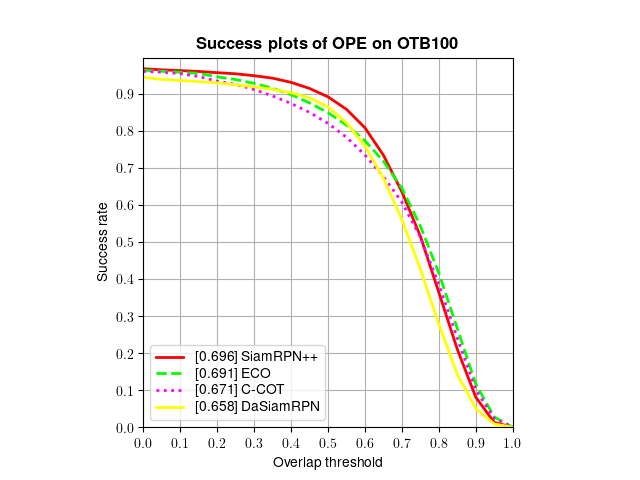
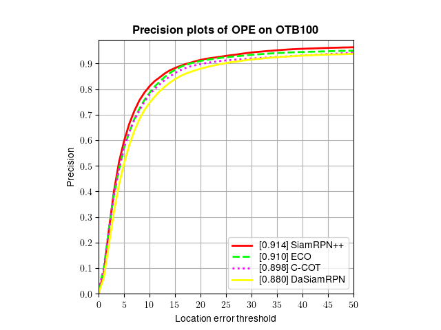
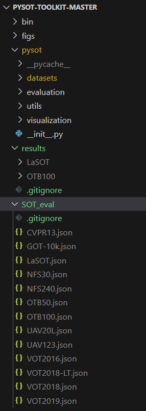
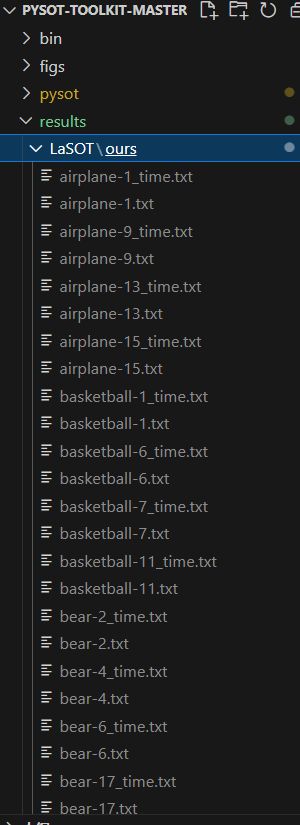
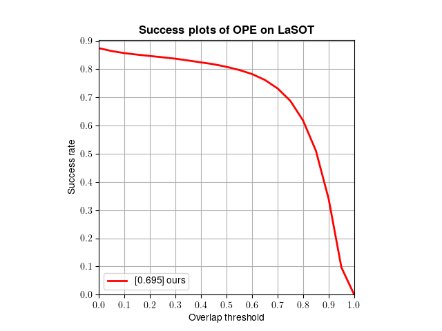

# pysot-toolkit-convenience
本项目在pysot-toolkit上进行改进，旨在简化测试与绘图过程，感谢原作者的工作！！！
同时也感谢该博主的使用教程[学习PySOT画图](https://blog.csdn.net/weixin_42495721/article/details/110855071)

The purpose of this repo is to provide evaluation API of Current Single Object Tracking Dataset, including

- [x] [VOT2016](http://www.votchallenge.net/vot2016/dataset.html)
- [x] [VOT2018](http://www.votchallenge.net/vot2018/dataset.html)
- [x] [VOT2018-LT](http://www.votchallenge.net/vot2018/dataset.html)
- [x] [OTB100(OTB2015)](http://cvlab.hanyang.ac.kr/tracker_benchmark/datasets.html)
- [x] [UAV123](https://ivul.kaust.edu.sa/Pages/Dataset-UAV123.aspx)
- [x] [NFS](http://ci2cv.net/nfs/index.html)
- [x] [LaSOT](https://cis.temple.edu/lasot/)
- [ ] [TrackingNet (Evaluation on Server)](https://tracking-net.org)
- [ ] [GOT-10k (Evaluation on Server)](http://got-10k.aitestunion.com)

## Install 


```bash
git clone https://github.com/StrangerZhang/pysot-toolkit
pip install -r requirements.txt
cd pysot/utils/
python setup.py build_ext --inplace
# if you need to draw graph, you need latex installed on your system
```

## ~~Download Dataset~~，不需要下载数据集，但是下面的步骤要执行

Download json files used in our toolkit [baidu pan](https://pan.baidu.com/s/1js0Qhykqqur7_lNRtle1tA) or [Google Drive](https://drive.google.com/drive/folders/10cfXjwQQBQeu48XMf2xc_W1LucpistPI)

1. Put CVRP13.json, OTB100.json, OTB50.json in OTB100 dataset directory (you need to copy Jogging to Jogging-1 and Jogging-2, and copy Skating2 to Skating2-1 and Skating2-2 or using softlink)

   The directory should have the below format

   | -- OTB100/

   ​	| -- Basketball

   ​	| 	......

   ​	| -- Woman

   ​	| -- OTB100.json

   ​	| -- OTB50.json

   ​	| -- CVPR13.json

2. Put all other jsons in the dataset directory like in step 1

## Usage

### 1. Evaluation on VOT2018(VOT2016)
```bash
cd /path/to/pysot-toolkit
python bin/eval.py \
	--dataset_dir /path/to/dataset/root \		# dataset path
	--dataset VOT2018 \				# dataset name(VOT2018, VOT2016)
	--tracker_result_dir /path/to/tracker/dir \	# tracker dir
	--trackers ECO UPDT SiamRPNpp 			# tracker names 

# you will see
------------------------------------------------------------
|Tracker Name| Accuracy | Robustness | Lost Number |  EAO  |
------------------------------------------------------------
| SiamRPNpp  |  0.600   |   0.234    |    50.0     | 0.415 |
|    UPDT    |  0.536   |   0.184    |    39.2     | 0.378 |
|    ECO     |  0.484   |   0.276    |    59.0     | 0.280 |
------------------------------------------------------------
```
### 2. Evaluation on OTB100(UAV123, NFS, LaSOT)

converted *.txt tracking results will be released soon 

```bash
cd /path/to/pysot-toolkit
python bin/eval.py \
	--dataset_dir /path/to/dataset/root \		# dataset path
	--dataset OTB100 \				# dataset name(OTB100, UAV123, NFS, LaSOT)
	--tracker_result_dir /path/to/tracker/dir \	# tracker dir
	--trackers SiamRPN++ C-COT DaSiamRPN ECO  \	# tracker names 
	--num 4 \				  	# evaluation thread
	--show_video_level \ 	  			# wether to show video results
	--vis 					  	# draw graph

# you will see (Normalized Precision not used in OTB evaluation)
-----------------------------------------------------
|Tracker name| Success | Norm Precision | Precision |
-----------------------------------------------------
| SiamRPN++  |  0.696  |     0.000      |   0.914   |
|    ECO     |  0.691  |     0.000      |   0.910   |
|   C-COT    |  0.671  |     0.000      |   0.898   |
| DaSiamRPN  |  0.658  |     0.000      |   0.880   |
-----------------------------------------------------

-----------------------------------------------------------------------------------------
|    Tracker name     |      SiamRPN++      |      DaSiamRPN      |         ECO         |
-----------------------------------------------------------------------------------------
|     Video name      | success | precision | success | precision | success | precision |
-----------------------------------------------------------------------------------------
|     Basketball      |  0.423  |   0.555   |  0.677  |   0.865   |  0.653  |   0.800   |
|        Biker        |  0.728  |   0.932   |  0.319  |   0.448   |  0.506  |   0.832   |
|        Bird1        |  0.207  |   0.360   |  0.274  |   0.508   |  0.192  |   0.302   |
|        Bird2        |  0.629  |   0.742   |  0.604  |   0.697   |  0.775  |   0.882   |
|      BlurBody       |  0.823  |   0.879   |  0.759  |   0.767   |  0.713  |   0.894   |
|      BlurCar1       |  0.803  |   0.917   |  0.837  |   0.895   |  0.851  |   0.934   |
|      BlurCar2       |  0.864  |   0.926   |  0.794  |   0.872   |  0.883  |   0.931   |
......
|        Vase         |  0.564  |   0.698   |  0.554  |   0.742   |  0.544  |   0.752   |
|       Walking       |  0.761  |   0.956   |  0.745  |   0.932   |  0.709  |   0.955   |
|      Walking2       |  0.362  |   0.476   |  0.263  |   0.371   |  0.793  |   0.941   |
|        Woman        |  0.615  |   0.908   |  0.648  |   0.887   |  0.771  |   0.936   |
-----------------------------------------------------------------------------------------
```

|     OTB100 Success Plot   	    | OTB100 Precision Plot	    |
| --------------------------------- | ----------------------------- |
|  	    |  	    |

### 3. Evaluation on VOT2018-LT

```bash
cd /path/to/pysot-toolkit
python bin/eval.py \
	--dataset_dir /path/to/dataset/root \		# dataset path
	--dataset VOT2018-LT \				# dataset name
	--tracker_result_dir /path/to/tracker/dir \	# tracker dir
	--trackers SiamRPN++ MBMD DaSiam-LT \		# tracker names 
	--num 4 \				  	# evaluation thread
	--vis \					  	# wether to draw graph

# you will see
-------------------------------------------
|Tracker Name| Precision | Recall |  F1   |
-------------------------------------------
| SiamRPN++  |   0.649   | 0.610  | 0.629 |
|    MBMD    |   0.634   | 0.588  | 0.610 |
| DaSiam-LT  |   0.627   | 0.588  | 0.607 |
|    MMLT    |   0.574   | 0.521  | 0.546 |
|  FuCoLoT   |   0.538   | 0.432  | 0.479 |
|  SiamVGG   |   0.552   | 0.393  | 0.459 |
|   SiamFC   |   0.600   | 0.334  | 0.429 |
-------------------------------------------
```

## Get Tracking Results of Your Own Tracker

Add pysot-toolkit to your PYTHONPATH

```bash
export PYTHONPATH=/path/to/pysot-toolkit:$PYTHONPATH
```

### 1. OPE (One Pass Evaluation)

```python
from pysot.datasets import DatasetFactory

dataset = DatasetFactory.create_dataset(name=dataset_name,
                                       	dataset_root=datset_root,
                                        load_img=False)
for video in dataset:
    for idx, (img, gt_bbox) in enumerate(video):
        if idx == 0:
            # init your tracker here
        else:
            # get tracking result here
```

### 2. Restarted Evaluation

```python
from pysot.datasets import DatasetFactory
from pysot.utils.region import vot_overlap

dataset = DatasetFactory.create_dataset(name=dataset_name,
                                       	dataset_root=datset_root,
                                        load_img=False)
frame_counter = 0
pred_bboxes = []
for video in dataset:
    for idx, (img, gt_bbox) in enumerate(video):
        if idx == frame_counter:
            # init your tracker here
            pred_bbox.append(1)
        elif idx > frame_counter:
            # get tracking result here
            pred_bbox = 
            overlap = vot_overlap(pred_bbox, gt_bbox, (img.shape[1], img.shape[0]))
            if overlap > 0: 
	    	# continue tracking
                pred_bboxes.append(pred_bbox)
            else: 
	    	# lost target, restart
                pred_bboxes.append(2)
                frame_counter = idx + 5
        else:
            pred_bboxes.append(0)
```
### 3. 对于该画图项目的补充说明
<mark>本项目只需把自己的测试结果放到对应文件目录中即可直接对上述数据集进行测试和绘图，无需下载数据集<mark>
#### 1.如何启动？
    如果是编译器启动则无需export PYTHONPATH(因为编译器自动export)
#### 2.对数据集的优化
      其实单纯地测试结果和绘制OPE图不需要下载全部数据集，只需使用原作者提供的eval_SOT中的json文件即可，我们把其放到了./SOT_eval目录下，所以dataset_dir默认为该路径，无需填写；其次，在video.py中删除了加载图片的代码，因为单纯地测试结果不需要加载图片；
      所以，最终的效果为使用该项目只需把自己的测试结果放到对应文件目录中即可直接对上述数据集进行测试和绘图，无需下载数据集。
#### 3.版本设置
      我们的项目基于python=3.8实现，无需下载requirements.txt中的glob(python=3.x版本即自带glob)
#### 4.debug
      lasot.py中的分割代码已将','替换为'\t'，其他可能出现的类似问题同理。
#### 5.跟踪结果目录
      在/results目录中放置跟踪结果，以LaSOT为例，在/results/LaSOT中存放结果，如图所示，只需把txt文件名与数据集中的视频名对应上即可。


#### 4.执行示例
```python
python bin/eval.py --dataset LaSOT --tracker_result_dir ./results/LaSOT --trackers ours --num 1  --show_video_level --vis
```
  


